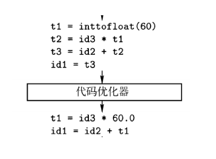

## Chapter 1 Introduction

### Functions of a Compiler

#### Compiler

- Input a program written in some kind of language(source language)
- output this program in another language(target language)
- this program supposed to be executable

#### Interpreter

- Use inputs to execute the given operations in source program
- No target program is generated, executed directly
- Java is a kind of language that integrated Compiler & Interpreter

### Structure

#### Analysis/Front end

- program to token & syntax structure
- structure built intermediate representation
- info to symbol table

#### Synthesis/Back end(related to machine)

- construct target program using the representation & symbol table

#### Phases

### Lexical analysis

#### Scanning

- output Lexeme
- <token-name, attribute-value>
- token-name works for syntax analysis
- attribute-value works for semantic analysis & code generating

### Syntax analysis

#### Parsing

- Build Syntax tree
- Get syntax structure

### Semantic analysis

- check with symbol table & syntax tree
- generate code, check types, type shift

### Generate intermediate code

### Polish

- faster & more effective

### Final code generating

- allocate registers
- choose proper operations

### Others

#### Symbol table

- Record variables' name & attributions

#### Tools

- Scanner: Lex/Flex
- Syntax analyzer: Yacc/Bison
- Other transcript engines...

#### Applications

- Program Transcription
- SF Quality & Productivity
  - type check
  - bound check
  - internal memory manage
